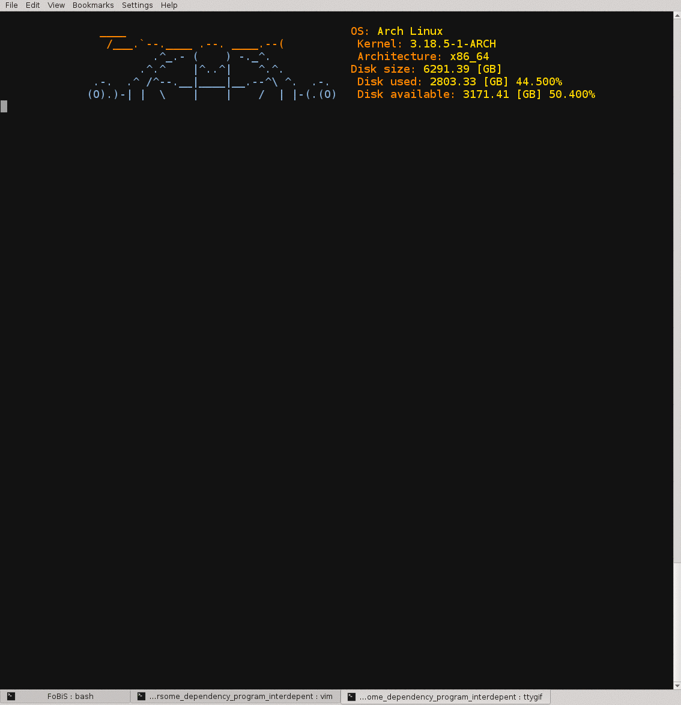

# FoBiS.py usage example on a cumbersome dependency program (with external interdependency project/fobos)

A KISS usage example of FoBiS.py

## Description

This example consists of a very simple program, _cumbersome.f90_ contained into _src_ directory. This program is a cumbersome version of a classical _hello world_. The main program depends on 2 external libraries contained into `dependency_lib_1` and `dependency_lib_2`. The building of the main program depends on the up-to-date status of the dependency libraries.

For testing the example type one of the followings

+ `FoBiS.py clean`;
+ `FoBiS.py build`;

### What we learn from this example?
This example demonstrates how to set an interdependent *project*, meaning a project that *depends on* another by means of its fobos file.
```bash
├── dependency_lib_1
│   ├── fobos_lib
│   └── src
├── dependency_lib_2
│   ├── fobos_lib
│   └── src
├── fobos
├── README.md
└── src
    └── cumbersome.f90
```
The building of the main program depends on the up-to-date status of the dependency libraries. To establish this interdependency use the `dependon` option
```ini
...
dependon = ./dependency_lib_1/fobos_lib:static ./dependency_lib_2/fobos_lib:static
...
```
Note that the buildings of dependencies are done in sequence of their definition. For more details on the `dependon` syntax see the [wiki](https://github.com/szaghi/FoBiS/wiki/Autorebuild-with-interdependent-projects).

It is worth noting that both the above option can be directly passed as Command Line Arguments to FoBiS.py using the corresponding switch.

### Screencast


